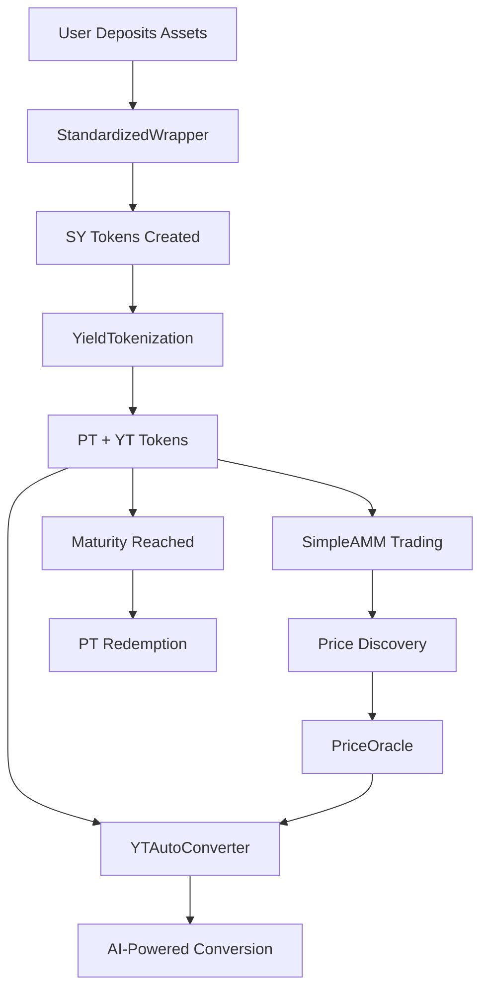

# Marlin 

<div align="center">
  
  
  
</div>

**Marlin** is an AI-powered DeFi protocol built on Algorand that revolutionizes yield farming through intelligent yield tokenization. The protocol splits yield-bearing assets into Principal Tokens (PT) and Yield Tokens (YT), enabling sophisticated investment strategies powered by machine learning and real-time market analysis.

## 🚀 Key Features

### 🧠 AI-Powered Investment Intelligence
- **LSTM Price Prediction**: Advanced machine learning models for price forecasting
- **Risk Assessment**: Multi-criteria decision analysis (TOPSIS) for optimal pool ranking
- **Automated Recommendations**: AI-driven investment suggestions based on user risk profiles
- **Real-time Market Analysis**: Integration with DeFiLlama for comprehensive yield data

### 💎 Yield Tokenization Protocol
- **Principal Tokens (PT)**: Represent claim to underlying assets at maturity
- **Yield Tokens (YT)**: Capture future yield until maturity, tradeable before maturity
- **Flexible Maturities**: Support for 3, 6, 9, and 12-month investment horizons
- **Automated Conversion**: AI-powered YT→PT conversion based on market conditions

### 🔄 Comprehensive DeFi Infrastructure
- **Automated Market Maker (AMM)**: Constant product AMM for PT/YT token trading
- **Price Oracle**: Secure price feeds with circuit breakers and threshold monitoring
- **Staking DApp**: Time-based rewards and compound staking functionality
- **Standardized Wrapper**: Multi-token wrapping into standardized yield tokens

## 🏗️ Project Architecture

Marlin is structured as a monorepo with three main components:

```
marlin/
├── projects/
│   ├── marlin-contracts/     # Smart contracts (Algorand)
│   ├── marlin-frontend/      # React/Next.js frontend
│   └── ai-agent/            # AI backend (FastAPI)
├── README.md
└── marlin.code-workspace
```

### 📋 Smart Contracts (`marlin-contracts/`)

**Core Protocol Contracts:**
- **YieldTokenization**: Core protocol for splitting SY tokens into PT/YT
- **PTToken**: Principal Token implementation with maturity management
- **YTToken**: Yield Token for capturing future yield
- **StandardizedWrapper**: Multi-token aggregation interface

**Infrastructure Contracts:**
- **SimpleAMM**: Constant product AMM for token swaps
- **PriceOracle**: Secure price feeds with validation
- **StakingDapp**: Yield generation and rewards distribution
- **YTAutoConverter**: AI-powered automated conversion

### 🎨 Frontend Application (`marlin-frontend/`)

**Dashboard Components:**
- **AI Analytics Dashboard**: Real-time AI insights and recommendations
- **Token Management**: PT/YT token operations and transfers
- **AMM Interface**: Liquidity provision and token swapping
- **Yield Tokenization**: Protocol interaction and position management
- **Price Oracle Monitor**: Real-time price feed monitoring
- **Auto Converter Interface**: AI automation configuration
- **Wrapper Interface**: Multi-token wrapping operations

**Key Features:**
- **Wallet Integration**: Support for Algorand wallets
- **Real-time Data**: Live price feeds and market data
- **Transaction Management**: Seamless smart contract interactions
- **Responsive Design**: Modern UI with Tailwind CSS

### 🤖 AI Agent Backend (`ai-agent/`)

**Core AI Components:**
- **LSTM Model**: Price prediction using gradient boosting regression
- **DeFiLlama Integration**: Real-time yield farming data and AI narratives
- **Algorand Integration**: Direct smart contract interaction
- **Risk Analysis**: Multi-criteria decision analysis for pool ranking

**API Endpoints:**
- **Investment Optimization**: AI-powered PT/YT split recommendations
- **Pool Recommendations**: DeFiLlama-based yield farming suggestions
- **Price Data**: Historical and real-time price information
- **Contract Interaction**: Smart contract execution and monitoring

## 🔗 Smart Contract Integration

The frontend seamlessly integrates with Algorand smart contracts through:

### Contract Hooks (`hooks/contracts/`)
- **PriceOracle.ts**: Price feed monitoring and threshold alerts
- **PTToken.ts**: Principal token operations and balance management
- **SimpleAMM.ts**: AMM interactions and liquidity management
- **StakingDapp.ts**: Staking operations and rewards tracking
- **StandardizedWrapper.ts**: Multi-token wrapping functionality
- **YieldTokenization.ts**: Core protocol interactions
- **YTAutoConverter.ts**: AI automation configuration
- **YTToken.ts**: Yield token operations

### Integration Flow
1. **Contract Deployment**: Smart contracts deployed to Algorand network
2. **ABI Generation**: Contract ABIs automatically generated and stored
3. **TypeScript Clients**: Frontend generates typed contract clients
4. **Real-time Updates**: Contract state synchronized with UI components
5. **Transaction Management**: Seamless transaction creation and monitoring

## 🚀 Quick Start

### Prerequisites
- [Docker](https://www.docker.com/) for local Algorand network
- [AlgoKit CLI](https://github.com/algorandfoundation/algokit-cli#install)
- [Node.js](https://nodejs.org/) 18+ for frontend
- [Python](https://python.org/) 3.12+ for contracts and AI agent

### Initial Setup

1. **Clone and Bootstrap**
   ```bash
   git clone <repository-url>
   cd marlin
   algokit project bootstrap all
   ```

2. **Configure Environment**
   ```bash
   # Smart contracts
   cd projects/marlin-contracts
   algokit generate env-file -a target_network localnet
   
   # AI agent
   cd ../ai-agent
   cp env.example .env
   # Edit .env with your API keys
   ```

3. **Start Local Network**
   ```bash
   algokit localnet start
   ```

4. **Deploy Contracts**
   ```bash
   cd projects/marlin-contracts
   algokit project deploy localnet
   ```

5. **Start AI Agent**
   ```bash
   cd projects/ai-agent
   pip install -r requirements.txt
   python main.py
   ```

6. **Start Frontend**
   ```bash
   cd projects/marlin-frontend
   npm install
   npm run dev
   ```

## 🛠️ Development Workflow

### Smart Contract Development
```bash
# Build contracts
algokit project run build

# Deploy to testnet
algokit project deploy testnet

# Run tests
pytest tests/
```

### Frontend Development
```bash
# Install dependencies
npm install

# Start development server
npm run dev

# Build for production
npm run build
```

### AI Agent Development
```bash
# Install dependencies
pip install -r requirements.txt

# Run with hot reload
uvicorn main:app --reload

# Run tests
pytest
```

## 📊 Protocol Flow



## 🔧 Configuration

### Environment Variables

**AI Agent (`ai-agent/.env`):**
```bash
# Required: Gemini AI API key
GEMINI_API_KEY=your_gemini_api_key_here

# Algorand configuration
NETWORK=testnet
ALGOD_ADDRESS=https://testnet-api.algonode.cloud/
ALGOD_TOKEN=

# Smart contract app IDs (after deployment)
YIELD_TOKENIZATION_APP_ID=123456789
PT_TOKEN_APP_ID=123456790
# ... etc
```

**Frontend (`marlin-frontend/.env.local`):**
```bash
# Vestige Labs API
NEXT_PUBLIC_VESTIGE_API_URL=https://api.vestigelabs.org
NEXT_PUBLIC_VESTIGE_API_KEY=your_api_key

# AI Agent API
NEXT_PUBLIC_AI_AGENT_URL=http://localhost:8000
```

## 🧪 Testing

### Smart Contracts
```bash
cd projects/marlin-contracts
pytest tests/ -v
```

### Frontend
```bash
cd projects/marlin-frontend
npm test
```

### AI Agent
```bash
cd projects/ai-agent
pytest
```

## 📚 Documentation

- **Smart Contracts**: [marlin-contracts/README.md](projects/marlin-contracts/README.md)
- **Frontend**: [marlin-frontend/README.md](projects/marlin-frontend/README.md)
- **AI Agent**: [ai-agent/README.md](projects/ai-agent/README.md)
- **Integration Guide**: [marlin-contracts/smart_contracts/integration_guide.md](projects/marlin-contracts/smart_contracts/integration_guide.md)

## 🌐 Network Support

- **Testnet**: Algorand Testnet (current)
- **Mainnet**: Algorand Mainnet (future)
- **Localnet**: Local development network

## 🤝 Contributing

1. Fork the repository
2. Create a feature branch
3. Make your changes
4. Add tests
5. Submit a pull request

## 📄 License

This project is licensed under the MIT License - see the LICENSE file for details.

## 🆘 Support

- **Documentation**: Check the project READMEs
- **Issues**: Open GitHub issues for bugs
- **Community**: Join [Algorand Discord](https://discord.gg/algorand)

---

<div align="center">
  <strong>Built with ❤️ for the Algorand ecosystem</strong><br>
  <em>Transforming DeFi with AI-powered yield optimization</em>
</div>
