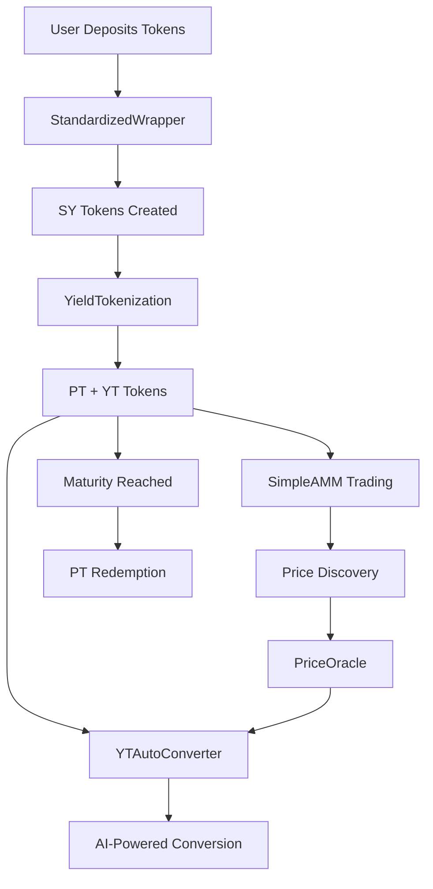

# 🚀 Tesserapt - Algorand Smart Contracts for AI Investment Advisor

<div align="center">
  
  
  [](https://testnet.algoexplorer.io/)
  [](https://python.org)
  [](https://github.com/algorandfoundation/algokit-cli)
</div>

This directory contains **Algorand smart contracts** converted from the Aptos Move implementation, powering the AI-driven DeFi investment platform with:

- 🧠 **LSTM-based forecasting** for optimal PT/YT token splits
- 💧 **Liquidity Pool Recommendations** with AI-powered analysis  
- 📊 **Real-time Market Data** integration
- 📈 **Advanced Analytics** and portfolio tracking

## 🏗️ Smart Contract Architecture

### Core Contracts

| Contract | Purpose | Key Features |
|----------|---------|--------------|
| **YieldTokenization** | Core protocol logic | Split SY → PT+YT, maturity management, redemption |
| **PTToken** | Principal Token | Redemption rights at maturity, transferable |
| **YTToken** | Yield Token | Future yield capture, tradeable before maturity |
| **StandardizedWrapper** | Token aggregation | Multi-token wrapping into SY tokens |

### Infrastructure Contracts

| Contract | Purpose | Key Features |
|----------|---------|--------------|
| **SimpleAMM** | Decentralized Exchange | Constant product AMM, PT/YT trading, liquidity provision |
| **StakingDapp** | Yield Generation | Time-based rewards, compound staking |
| **PriceOracle** | Price Feeds | Secure price updates, threshold monitoring, circuit breakers |
| **YTAutoConverter** | AI Automation | Automated YT→PT conversion, threshold-based execution |

## 🚀 Quick Start

### 1. Environment Setup

```bash
# Clone and navigate to contracts directory
cd staking-application/src/contracts/algorand_contracts

# Setup development environment
python setup_environment.py

# Activate virtual environment
# Windows:
venv\Scripts\activate
# macOS/Linux:
source venv/bin/activate
```

### 2. Install Dependencies

```bash
# Install all required packages
pip install -r requirements.txt

# Verify AlgoKit installation
algokit --version
```

### 3. Configure Environment

```bash
# Create environment configuration
cp .env.template .env

# Edit .env with your settings
# - Set NETWORK (testnet/mainnet/localnet)
# - Add DEPLOYER_MNEMONIC (optional)
# - Configure API keys
```

### 4. Deploy Contracts

```bash
# Deploy all contracts to testnet
python deploy_contracts.py

# This creates:
# - deployment_info.json (complete deployment data)
# - contract_addresses.ts (frontend integration file)
```

## 🔄 Protocol Flow



## 💻 Usage Examples

### Basic Token Flow

```python
from algosdk import account, mnemonic
from algosdk.v2client import algod

# Setup client
algod_client = algod.AlgodClient("", "https://testnet-api.algonode.cloud")
user_sk = mnemonic.to_private_key("your mnemonic here")

# 1. Wrap tokens into SY
wrapper_app_id = TESSERAPT_CONTRACTS.contracts.standardizedwrapper
# Call wrap_tokens(amount0, amount1)

# 2. Split SY into PT/YT  
tokenization_app_id = TESSERAPT_CONTRACTS.contracts.yieldtokenization
# Call split_tokens(amount, maturity)

# 3. Trade on AMM
amm_app_id = TESSERAPT_CONTRACTS.contracts.simpleamm
# Call swap_a_for_b(amount_in) or swap_b_for_a(amount_in)

# 4. Setup AI automation
converter_app_id = TESSERAPT_CONTRACTS.contracts.ytautoconverter
# Call configure_conversion(enabled, threshold_price, maturity)
```

### Frontend Integration (React/TypeScript)

```typescript
import { TESSERAPT_CONTRACTS } from './contract_addresses';
import { useWallet } from '@txnlab/use-wallet';

export function TesseraptDashboard() {
  const { activeAddress, signTransactions } = useWallet();
  
  const splitTokens = async (amount: number, maturity: number) => {
    const appCallTxn = algosdk.makeApplicationCallTxnFromObject({
      from: activeAddress,
      appIndex: TESSERAPT_CONTRACTS.contracts.yieldtokenization,
      onComplete: algosdk.OnApplicationComplete.NoOpOC,
      appArgs: [
        new Uint8Array(Buffer.from('split_tokens')),
        algosdk.encodeUint64(amount),
        algosdk.encodeUint64(maturity)
      ],
      // ... other parameters
    });
    
    const signedTxns = await signTransactions([appCallTxn]);
    // Submit to network
  };
  
  return <div>Your Tesserapt UI</div>;
}
```

## 🧪 Testing

```bash
# Run all tests
pytest tests/ -v

# Run specific test categories
pytest tests/test_basic_functionality.py -v

# Run with coverage
pytest tests/ --cov=contracts --cov-report=html
```

## 📊 Contract Methods Reference

### YieldTokenization Contract

```python
# Core Methods
initialize(base_name: String, base_symbol: String) -> String
create_maturity(maturity_timestamp: UInt64) -> String
split_tokens(amount: UInt64, maturity: UInt64) -> String
redeem_tokens(amount: UInt64, maturity: UInt64) -> String

# Query Methods  
get_user_balances() -> (UInt64, UInt64, UInt64)  # SY, PT, YT
get_maturity_count() -> UInt64
is_protocol_paused() -> UInt64

# Admin Methods
pause_protocol() -> String
unpause_protocol() -> String
```

### SimpleAMM Contract

```python
# Liquidity Methods
add_liquidity(amount_a: UInt64, amount_b: UInt64) -> String
remove_liquidity(liquidity_amount: UInt64) -> String

# Trading Methods
swap_a_for_b(amount_in: UInt64) -> String
swap_b_for_a(amount_in: UInt64) -> String

# Query Methods
get_reserves() -> (UInt64, UInt64)
get_amount_out(amount_in: UInt64, reserve_in: UInt64, reserve_out: UInt64) -> UInt64
get_user_liquidity() -> (UInt64, UInt64, UInt64)
```

### YTAutoConverter Contract

```python
# Configuration Methods
configure_conversion(enabled: UInt64, threshold_price: UInt64, maturity: UInt64) -> String
add_maturity(maturity: UInt64) -> String
remove_maturity() -> String

# Execution Methods
execute_conversion(user: Bytes, min_pt_amount: UInt64, deadline: UInt64) -> String
can_execute_conversion(user: Bytes) -> UInt64

# AI Methods
get_ai_recommendation(yt_amount: UInt64, current_price: UInt64) -> (UInt64, String)
calculate_conversion_output(yt_amount: UInt64) -> (UInt64, UInt64)
```

## 🔒 Security Features

- ✅ **Access Control**: Admin-only functions with sender verification
- ✅ **Input Validation**: Comprehensive bounds checking and validation
- ✅ **Pause Mechanisms**: Emergency pause functionality across all contracts
- ✅ **Circuit Breakers**: Price oracle protection against extreme conditions
- ✅ **Reentrancy Protection**: State updates before external calls
- ✅ **Slippage Protection**: AMM trades with minimum output guarantees

## 🌐 Network Support

### Testnet (Current)
- **Network**: Algorand Testnet
- **Node**: https://testnet-api.algonode.cloud
- **Explorer**: https://testnet.algoexplorer.io/
- **Faucet**: https://testnet.algoexplorer.io/dispenser

### Mainnet (Future)
- **Network**: Algorand Mainnet  
- **Node**: https://mainnet-api.algonode.cloud
- **Explorer**: https://algoexplorer.io/

## 📁 Project Structure

```
algorand_contracts/
├── core/
│   └── yield_tokenization.py      # Core protocol logic
├── tokens/
│   ├── pt_token.py                # Principal Token
│   ├── yt_token.py                # Yield Token
│   └── standardized_wrapper.py    # Token wrapper
├── infrastructure/
│   ├── simple_amm.py              # AMM for trading
│   └── staking_dapp.py            # Staking rewards
├── oracles/
│   └── price_oracle.py            # Price feeds
├── advanced/
│   └── yt_auto_converter.py       # AI automation
├── tests/
│   └── test_basic_functionality.py
├── deploy_contracts.py            # Deployment script
├── setup_environment.py           # Environment setup
├── config.py                      # Configuration
├── requirements.txt               # Dependencies
└── integration_guide.md           # Integration docs
```

## 🤖 AI Integration

The contracts are designed to integrate with AI/ML models:

- **LSTM Price Prediction**: YTAutoConverter uses price thresholds from ML models
- **Risk Assessment**: Personalized recommendations based on user risk profiles  
- **Market Analysis**: Real-time data integration via PriceOracle
- **Automated Execution**: Smart contract automation based on AI signals

## 🛠️ Development Tools

- **AlgoKit**: Algorand development toolkit
- **PyTeal**: Python to TEAL compilation (if needed)
- **Algorand Python SDK**: Blockchain interaction
- **Pytest**: Testing framework
- **Black**: Code formatting
- **MyPy**: Type checking

## 📚 Resources

- **[Integration Guide](integration_guide.md)**: Detailed integration instructions
- **[Algorand Developer Portal](https://developer.algorand.org/)**: Official documentation
- **[AlgoKit Documentation](https://github.com/algorandfoundation/algokit-cli)**: Development toolkit
- **[Algorand Python SDK](https://py-algorand-sdk.readthedocs.io/)**: SDK documentation

## 🆘 Support

For issues and questions:

1. Check the [Integration Guide](integration_guide.md)
2. Review test files for usage examples
3. Join [Algorand Discord](https://discord.gg/algorand) for community support
4. Open GitHub issues for bugs

## 🎯 Next Steps

1. **Deploy to Testnet**: Use the deployment script
2. **Frontend Integration**: Import contract addresses into your React app
3. **AI Model Integration**: Connect LSTM models for price prediction
4. **Mainnet Deployment**: Deploy to production when ready

---

<div align="center">
  <strong>Built with ❤️ for the Algorand ecosystem</strong><br>
  <em>Transforming DeFi with AI-powered yield optimization</em>
</div>